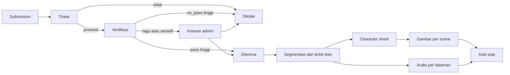

# Peta Legenda Nusantara: PRD v1.1

| | |
|---|---|
| Versi | 1.1 |
| Tanggal | 19 September 2026 |
| Konteks | Capstone (tugas akhir). Pengembang tunggal dibantu AI agent |
| Target demo | 10-17 Oktober 2026 (3-4 minggu) |
| Eksekutor kode | Antigravity |
| Bahasa produk | Indonesia |
| Scope | P0 dan P1. Semua P2 dicoret (lihat 2.2) |

---

## 0. Untuk agent: cara membaca dan bekerja

- Dokumen ini adalah sumber kebenaran. Jika ada yang ambigu, pilih opsi paling sederhana, catat di `docs/ASSUMPTIONS.md`, lalu lanjut. Jangan menambah fitur di luar PRD.
- Kerjakan per milestone (bagian 15), berurutan. Di akhir tiap milestone: berhenti, laporkan yang selesai, yang belum, aset yang masih berupa placeholder, dan variabel ENV baru. Jangan lanjut ke milestone berikutnya tanpa instruksi.
- Aturan kode: TypeScript strict, ringkas dan pragmatis. Tanpa komentar per baris (komentar hanya untuk alasan yang tidak jelas dari kode). Nama variabel singkat tapi jelas. Tanpa dependensi, error handling, atau validasi yang tidak diminta PRD, kecuali batas keamanan di bagian 12. Ikuti konvensi yang sudah ada di repo.
- Tanpa emoji di kode, UI, data seed, maupun dokumen.
- Slot aset visual yang belum ada ditandai `<!-- [GANTI DENGAN: nama-file.ext, ukuran] -->` (di JSX gunakan komentar setara) dan dicatat di `docs/ASSETS_PENDING.md`.
- Semua panggilan AI berbayar lewat provider registry (8.7). Komponen UI tidak pernah memanggil provider AI langsung.
- Nama model dan harga: baca dokumentasi resmi terbaru saat implementasi. Jangan mengandalkan ingatan.
- Secrets dan ENV: ikuti bagian 14.

---

## 1. Ringkasan produk

Peta Legenda Nusantara adalah bahan ajar interaktif berupa peta ilustrasi Indonesia. Tiap pin di peta adalah satu cerita rakyat (legenda, mite, fabel, dongeng). Cerita dibaca seperti buku gambar anak (setengah gambar, setengah teks) atau didengarkan dalam mode dongeng (gambar bergerak pelan dan suara pendongeng). Pengguna yang membuka aplikasi adalah orang tua atau guru yang membacakan atau membagikan cerita ke anak.

Siapa pun yang punya akun bisa menyumbang cerita. Setiap sumbangan diverifikasi oleh AI (dengan rujukan sumber) dan admin. Setelah lolos, sistem otomatis membuat ilustrasi per halaman dan narasi suara.

Nilai capstone: pipeline AI end-to-end (triase, verifikasi berbasis sumber, segmentasi, ilustrasi konsisten, narasi) dengan kontrol biaya dan evaluasi terukur.

## 2. Tujuan dan batasan

### 2.1 Tujuan

1. Peta ilustrasi yang akurat lokasinya tetapi ramah anak (bukan peta buta, bukan peta jalan).
2. Membaca dan mendengarkan cerita dengan satu gambar per halaman.
3. Kontribusi terbuka dengan verifikasi berlapis.
4. Adaptasi teks sesuai usia pembaca secara on-demand.
5. Pipeline AI yang murah, idempoten, dan dapat dievaluasi.

### 2.2 Di luar scope (P2, dicoret)

Fitur premium dan pembayaran; mode guru atau kelas; akun senior dan reputasi; cerita berbahasa daerah atau multi-bahasa; ElevenLabs atau suara premium; notifikasi email; suntingan cerita oleh non-kontributor; aplikasi native; mode offline penuh; analytics pihak ketiga; profil atau data anak.

### 2.3 Kriteria keberhasilan demo

- Alur penuh berjalan di HP dan laptop: splash, peta, cari, kartu cerita, baca, dongeng, simpan, lanjut baca.
- Satu kontribusi baru dikirim lewat form, lolos pipeline, dan tampil di peta dengan gambar dan suara (rekaman layar sebagai cadangan).
- Minimal 20 cerita seed dengan aset lengkap.
- Hasil evaluasi verifikator, gambar, dan suara tercatat (bagian 16).

---

## 3. Keputusan terkunci

| ID | Keputusan |
|---|---|
| D01 | Web app responsif dan PWA. Bukan native. |
| D02 | Peta memakai MapLibre GL JS dengan koordinat lat/lng asli. Tampilan gaya A dibangun dari layer GeoJSON sendiri (tanpa tile vektor OSM), sehingga tidak ada jalan atau bangunan. |
| D03 | Dua gaya peta: A "Kartun" (default) dan B "Lukisan" (Stamen Watercolor lewat Stadia Maps). Toggle bergaya Google Maps di layar peta. Pilihan gaya tidak terikat usia. |
| D04 | Reveal-by-zoom dengan 4 tier. Tier awal ditentukan admin, lalu otomatis dari jumlah pembaca dan simpan. |
| D05 | Search selalu menang: peta terbang ke hasil dan pin hasil dipaksa tampil. |
| D06 | Kartu cerita: panel kiri 1/3 layar di desktop, bottom sheet di mobile. |
| D07 | Hierarki data: Story > Version (sumber atau wilayah) > Adaptation (band usia) > Page. Page dan Scene selalu 1:1. |
| D08 | Aset generate hanya gambar statis dan audio. Gerak dibuat di frontend. |
| D09 | Satu halaman = satu gambar. Panjang cerita 6-14 halaman. |
| D10 | Aset digenerate hanya setelah lolos verifikasi. Cache permanen, tanpa regenerate-on-view. |
| D11 | Cerita tampil begitu lolos verifikasi dan tersegmentasi. Gambar belum ada memakai fallback background per jenis cerita. Mode dongeng terkunci sampai audio siap. |
| D12 | Simpan (per Story) dan Riwayat (upsert per user dan adaptation) terpisah, gaya YouTube. |
| D13 | Tanpa data anak. Akun hanya untuk orang tua atau guru (18+). Usia diisi setiap kali menekan Sesuaikan dan tidak disimpan di profil. |
| D14 | Adaptasi usia: teks asli tampil sebagai default. Sesuaikan bersifat on-demand, hasilnya di-cache dan dipakai ulang. Band: 3-4, 5-6, 7-9, 10-12. Gratis, wajib login, dibatasi kuota. |
| D15 | Semua akun dengan email terverifikasi boleh berkontribusi. Semua kontribusi diverifikasi. |
| D16 | Gerbang login: pengunjung anonim boleh membaca sebanyak max(1, floor(10% total halaman)) halaman. Setelah itu wajib login. |
| D17 | Verifikator adalah fungsi murni: input teks dan bukti, output JSON verdict. Tidak punya akses tulis ke konten. Perubahan status dilakukan orchestrator. |
| D18 | Provider AI: Gemini (teks, grounding, embedding, gambar, TTS) dan Z.ai GLM (triase dan pengecekan murah). Routing per tahap dapat diganti lewat konfigurasi. |
| D19 | Backend Supabase (Auth, Postgres, RLS, Storage, Realtime, Edge Functions). Pekerjaan AI dan media berjalan di worker Node terpisah. |
| D20 | Lisensi konten kontribusi CC BY-SA 4.0 dengan atribusi. |
| D21 | Gambar dan suara dilabeli sebagai hasil AI. |
| D22 | UI dan cerita berbahasa Indonesia. |

---

## 4. Peran dan akses

| Kemampuan | Anonim | Pengguna (login, email terverifikasi) | Admin |
|---|---|---|---|
| Jelajah peta, cari, kartu cerita | Ya | Ya | Ya |
| Membaca dan dongeng | Sampai batas gerbang (D16) | Penuh | Penuh |
| Simpan, riwayat | Tidak | Ya | Ya |
| Sesuaikan usia | Tidak | Ya (kuota) | Ya |
| Kirim kontribusi | Tidak | Ya (kuota) | Ya |
| Laporkan konten | Tidak | Ya | Ya |
| Antrean review, kelola konten, pengaturan | Tidak | Tidak | Ya |

Sistem (worker) memakai service role dan tidak terekspos ke klien.

Admin pertama diset lewat SQL atau env `APP_ADMIN_EMAILS` saat bootstrap.

---

## 5. Alur pengguna

**F1. Kunjungan pertama.** Layar tertutup awan dengan teks "Peta Legenda Nusantara". Awan tersibak ke kiri dan kanan, kamera zoom-in dari tampilan lebar ke peta Indonesia. Splash tampil sekali per sesi, dapat dilewati, dan diganti fade sederhana bila `prefers-reduced-motion`.

**F2. Jelajah.** Pengguna zoom, geser, atau mencari cerita atau daerah. Pin muncul bertahap sesuai zoom (D04). Hasil pencarian daerah membuka daftar cerita di panel kiri.

**F3. Kartu cerita.** Klik pin membuka kartu (panel kiri atau bottom sheet): foto hero, judul, jenis, wilayah, sinopsis, info lain. Aksi: Simpan dan Lanjut baca.

**F4. Baca.** Jika cerita punya lebih dari satu versi dan belum ada riwayat, pengguna memilih versi. Jika ada riwayat, tawarkan "Lanjutkan versi X halaman N" dan tautan "Pilih versi lain". Reader terbuka dalam mode Baca. Pengguna dapat pindah ke mode Dongeng.

**F5. Gerbang.** Anonim mencapai batas halaman gratis, modal login muncul. Setelah login, pengguna kembali ke halaman yang sama.

**F6. Sesuaikan.** Di dalam reader, tombol Sesuaikan meminta usia. Sistem memetakan usia ke band, membuat atau memakai ulang adaptasi, lalu reader memuat teks hasil adaptasi pada halaman yang sama. Tautan "Lihat versi asli" selalu tersedia.

**F7. Kontribusi.** Form multi-langkah, kirim, pantau status di "Kontribusi saya". Pipeline berjalan otomatis (bagian 8).

**F8. Review admin.** Admin membuka antrean, memeriksa hasil triase dan verifikator, lalu menyetujui atau menolak dengan alasan.

---

## 6. Spesifikasi fitur per modul

Prioritas: [P0] wajib untuk demo, [P1] tetap dikerjakan dalam 3-4 minggu tetapi dipotong lebih dulu jika terlambat (bagian 17).

### M1. Splash dan shell [P0]

- Splash sesuai F1. Peta dimuat di belakang splash, kamera dianimasikan saat awan tersibak.
- Shell: bar atas ringkas (logo, pencarian di desktop, tombol Profil, tombol Kontribusi). Di mobile: pencarian melayang di atas peta, navigasi lewat tombol Profil dan Kontribusi.
- Routing: `/` peta, `/cerita/:slug` kartu terbuka, `/baca/:versionId`, `/profil`, `/kontribusi`, `/kontribusi/baru`, `/admin/*`, `/masuk`, halaman legal.
- PWA: manifest, ikon, service worker (cache app shell, cache runtime untuk gambar dan audio dengan batas entri).

### M2. Peta [P0, toggle gaya P1]

- MapLibre GL JS, proyeksi Mercator. Batas pan: lng 94 sampai 142, lat -12 sampai 7. Zoom 3 sampai 12. Kamera awal berpusat di [118, -2.5], zoom menyesuaikan viewport.
- Sumber data: GeoJSON batas provinsi (semua zoom) dan kabupaten/kota (tampil mulai zoom 7), hasil olah data pada M10. Gunakan PMTiles hanya jika GeoJSON gzip melebihi 5 MB.
- **Gaya A (Kartun), dibangun dari layer**: laut berwarna dengan pola ombak halus; daratan dengan tekstur kertas dan garis pantai berlapis (bayangan, outline tebal membulat, outline dalam) supaya terasa seperti ilustrasi; batas provinsi putus-putus lembut; batas kabupaten lebih tipis; label nama provinsi dan kota memakai font ramah anak berlisensi terbuka. Tanpa jalan, bangunan, atau POI.
- **Ornamen**: sprite dari `ornaments.json` (id, sprite, lat, lng, minzoom, ukuran). Non-interaktif, di bawah pin, maksimal 40. Isi: kapal (laut), hewan ikonik per pulau, gunung, pohon. Penempatan hewan harus sesuai wilayah asalnya dan direview pemilik produk.
- **Gaya B (Lukisan)**: raster Stamen Watercolor dari Stadia Maps. Spike menentukan zoom maksimum efektif. Jika jejak jalan mengganggu di zoom tinggi, batasi zoom raster dan turunkan opacity di atas batas itu. Atribusi wajib tampil.
- Kedua gaya dimuat dalam satu style. Toggle hanya mengubah visibility layer, sehingga pin tidak dimuat ulang. Toggle berbentuk tombol persegi di pojok kiri bawah dengan thumbnail gaya lain (seperti Google Maps). Pilihan disimpan di localStorage dan, untuk pengguna login, di `profiles.preferred_map_style`. Default: gaya A.
- **Pin**: layer symbol dengan ikon per jenis cerita (4 warna/ikon), label judul mulai zoom 6 dengan collision detection, `symbol-sort-key` berdasarkan skor sehingga cerita populer menang saat bentrok.
- **Reveal**: pin tampil jika `tier <= tierForZoom(z)` atau id ada di `forceReveal`. Default: z<5 tier 1, 5 sampai <7 tier 1-2, 7 sampai <9 tier 1-3, z>=9 tier 1-4 (konfigurasi di `app_settings`).
- Pin diambil sekali (id, slug, judul, jenis, lat, lng, tier, skor, cover thumbnail) dan di-cache. Target sampai 5.000 pin.
- Posisi: `stories.lat/lng`. Jika beberapa cerita berjarak kurang dari 2 km, terapkan offset spiral deterministik berdasarkan id (di sisi klien, tanpa mengubah data).
- Klik pin: `flyTo` dengan padding mengikuti lebar panel, buka kartu, URL berubah ke `/cerita/:slug`. Deep link membuka peta pada cerita tersebut.
- Kontrol: zoom in/out, reset ke tampilan Indonesia, toggle gaya. Atribusi sumber data.

### M3. Pencarian dan kartu cerita [P0]

- Satu kolom pencarian untuk cerita dan wilayah. Debounce 200 ms. Indeks klien (MiniSearch atau setara) dari payload pin dan `regions` termasuk alias (contoh: "Jogja" = "Yogyakarta"). Hasil dikelompokkan: Cerita, Wilayah.
- Pilih wilayah: `fitBounds` ke wilayah, panel kiri menampilkan daftar cerita di wilayah itu (urut skor) dan semuanya di-force-reveal.
- Pilih cerita: `flyTo`, buka kartu, pin di-force-reveal.
- Force reveal dilepas saat pencarian dibersihkan.
- Kartu: hero (cover atau fallback), judul, chip jenis, chip wilayah, sinopsis, hingga 3 chip tema, jumlah versi, jumlah halaman, perkiraan durasi baca, badge "Ada suara" bila audio siap, label "Ilustrasi dan suara dibuat AI", sumber ringkas. Aksi: Simpan (toggle), Lanjut baca (atau "Lanjutkan halaman N"), "Punya versi lain? Kontribusikan" (membuka form dengan `target_story_id`).
- Desktop: panel kiri lebar 33vw (min 360 px, maks 480 px), dapat dilipat. Mobile: bottom sheet dengan tiga snap (30%, 55%, 92%) dan handle geser. Tombol kembali menutup kartu.
- Anonim menekan Simpan: tampilkan modal login.

### M4. Reader [P0]

- Data: halaman dari `pages` untuk adaptasi yang dipilih (default: adaptasi "asli").
- **Mode Baca**. Landscape (lebar >= 768 px dan rasio > 1): dua kolom 50/50, gambar di kiri dan teks di kanan. Portrait atau mobile: gambar di atas (sekitar 45% tinggi), teks di bawah dapat digulir. Navigasi: tombol sebelumnya/berikutnya, panah keyboard, geser di layar sentuh, bar progres. Ukuran teks minimal 18 px (mobile) dan 20 px (desktop).
- **Mode Dongeng**. Gambar tampil penuh dengan gerak pelan (pan/zoom ala Ken Burns dan transisi antar halaman, arah ditentukan deterministik dari id halaman, dibuat di frontend). Audio memutar per halaman dan otomatis maju saat selesai. Teks tampil sebagai subtitle (dapat disembunyikan). Kontrol: putar/jeda, sebelumnya/berikutnya, kecepatan 0.8x, 1x, 1.2x. Prefetch gambar dan audio halaman berikutnya.
- Dongeng terkunci bila `audio_status != ready`: tampilkan gembok dan pesan "Suara sedang disiapkan". Untuk adaptasi, tampilkan tombol "Buat suara" (memicu job TTS on-demand, status via Realtime).
- Gambar belum ada atau gagal: tampilkan fallback background sesuai jenis cerita, dengan teks kecil "Ilustrasi sedang dibuat" bila status masih diproses.
- Gerbang login sesuai D16. Batas dihitung `free_pages = max(1, floor(0.1 * total_pages))` per adaptasi. Berlaku juga untuk audio.
- Riwayat: upsert `read_history` saat pindah halaman (debounce 2 detik) dan saat keluar, mencatat `last_page`, `total_pages`, mode, `last_read_at`. Hanya untuk pengguna login. Anonim tidak dicatat.
- Pilih versi: kartu per versi (label, sumber, kontributor, jumlah halaman, badge aset). Versi terakhir dibaca ditandai.
- Header reader: judul, tombol Sesuaikan (M9), pindah mode, tutup. Alt text gambar diambil dari deskripsi scene.

### M5. Akun, gerbang, dan profil [P0, preferensi dan hapus akun P1]

- Supabase Auth: Google OAuth dan email/password. Verifikasi email wajib sebelum boleh berkontribusi atau memakai Sesuaikan. Saat daftar, checkbox "Saya berusia 18 tahun ke atas dan menyetujui Ketentuan dan Kebijakan Privasi".
- Data profil hanya `display_name`, `role`, `preferred_map_style`. Tidak ada usia, data anak, atau foto.
- Halaman Profil: Tersimpan (grid, hapus dari simpanan), Riwayat (daftar "Lanjutkan membaca" dengan progress, satu baris per story: adaptasi terbaru), Kontribusi saya (status dan alasan penolakan), Preferensi (gaya peta default) [P1], Hapus akun [P1] (menghapus profil, simpanan, riwayat, mengosongkan `contributor_id` pada versi dengan atribusi menjadi "Kontributor dihapus").
- Modal gerbang login dipakai bersama oleh Simpan, batas baca, Sesuaikan, dan Kontribusi. Setelah login, kembali ke konteks semula (URL dan halaman).

### M6. Kontribusi [P0]

- Form multi-langkah: (1) Info: judul, jenis (legenda, mite, fabel, dongeng), wilayah (pilih provinsi lalu kabupaten/kota dari gazetteer), titik lokasi opsional di peta, label versi (contoh: "Versi Kasunanan"); (2) Teks: minimal 150 kata, maksimal 3.000 kata; (3) Sumber: minimal satu (jenis: buku, arsip, web, lisan/narasumber; sitasi atau URL; penulis dan tahun bila ada); (4) Pernyataan hak: cerita adalah ceritaan ulang dengan kata sendiri atau berstatus domain publik, dan setuju dilisensikan CC BY-SA 4.0; (5) Tinjau dan kirim.
- Bila membuka form dari kartu cerita, `target_story_id` terisi dan sumbangan diperlakukan sebagai versi baru.
- Kuota: 3 kiriman per akun per hari (`app_settings`).
- Halaman "Kontribusi saya": status (Dikirim, Diperiksa, Perlu tinjauan admin, Diterima, Ditolak), alasan penolakan dari sistem atau admin, tombol "Kirim ulang" yang mengisi form dengan data sebelumnya.
- Teks kontributor dirender sebagai teks polos.

### M7. Pipeline AI [P0, adaptasi P1]

Lihat bagian 8.

### M8. Admin [P0, dashboard dan laporan P1]

- Akses hanya `role = admin` (dicek di RLS dan di route).
- **Antrean**: daftar submission (default: Perlu tinjauan). Detail: teks, sumber, hasil triase, hasil verifikator (verdict, confidence, discrepancies, matched sources dengan tautan, safety flags). Aksi: Setujui (opsi "jadikan versi baru untuk story X" bila terdeteksi duplikat), Tolak (alasan wajib, tampil ke kontributor), Jalankan ulang verifikasi.
- **Konten**: daftar story dan version. Aksi: ubah tier dan kunci tier (`tier_locked`), ubah koordinat pin, publish atau unpublish version, hapus adaptasi (invalidasi cache), coba ulang job aset yang gagal.
- **Pengaturan**: edit `app_settings` (auto publish, ambang confidence, kuota, anggaran harian, batas concurrency, ambang tier).
- **Dashboard biaya dan job** [P1]: biaya AI per tahap per hari dari `ai_usage`, total, job gagal atau tertunda.
- **Laporan** [P1]: daftar laporan pengguna (dari tombol "Laporkan" pada story, version, atau adaptasi). Aksi: abaikan, unpublish version, hapus adaptasi.

### M9. Sesuaikan usia [P1]

- Tombol "Sesuaikan dengan usia" di reader membuka modal: input usia (stepper 2-15), pratinjau band ("Disesuaikan untuk usia 5-6 tahun"), catatan bahwa teks disusun ulang AI dan bisa berbeda dari cerita asli. Usia >= 13 memakai teks asli. Usia < 3 dipetakan ke band 3-4.
- Wajib login dan email terverifikasi. Kuota 10 adaptasi baru per akun per hari. Adaptasi yang sudah ada di cache tidak menghitung kuota.
- Alur: Edge Function memeriksa cache `(version_id, age_band, prompt_version)`. Jika ada, langsung kembalikan. Jika tidak, buat baris `adaptations` berstatus `pending`, enqueue job, klien memantau lewat Realtime dengan indikator progres. Bila gagal, tampilkan pesan dan tetap di teks asli.
- Setelah siap, reader memuat teks adaptasi pada nomor halaman yang sama (1:1 dengan scene). Banner "Disesuaikan untuk usia X-Y (dibuat AI)" dengan tautan "Lihat versi asli".
- Audio adaptasi dibuat lazy: baru digenerate saat pengguna pertama kali memilih Dongeng pada adaptasi itu (tombol "Buat suara").
- Tidak ada usia atau identitas anak yang disimpan. Yang tersimpan hanya adaptasi (band) dan riwayat baca milik akun orang tua atau guru.

### M10. Data wilayah dan seed [P0]

- **Batas wilayah (geometri)**: unduh geoBoundaries ADM1 (provinsi) dan ADM2 (kabupaten/kota) Indonesia, verifikasi lisensi di halaman sumber sebelum dipakai, sederhanakan (mapshaper atau tippecanoe) sampai ukuran target M2. Geometri hanya untuk menggambar peta.
- **Gazetteer**: tabel `regions` dari dataset kode wilayah Kemendagri yang terbuka (contoh kandidat: `cahyadsn/wilayah`, `JoeSoep/wilayah`; cek lisensi) memuat kode, nama, level, induk, lat/lng centroid, bounding box, dan alias. Lokasi cerita memakai centroid dari gazetteer atau titik pilihan kontributor. Tidak ada spatial join ke geometri.
- **Seed cerita**: skrip `seed:import` membaca `content/seed/*.json` (skema di bagian 7) dan memasukkannya sebagai submission yang melewati pipeline sungguhan, sehingga seed sekaligus menjadi uji end-to-end.
- **Korpus RAG**: skrip `corpus:ingest` memecah dokumen di `content/corpus/` menjadi chunk, membuat embedding, dan menyimpannya di `corpus_chunks`.

### M11. Evaluasi dan tooling [P0]

Skrip `eval/` (bagian 16), `pipeline:smoke` (satu cerita pendek end-to-end), `env:check`, dan `seed:import`.

---

## 7. Model data

Semua tabel di skema `public`, RLS aktif. `id` bertipe uuid kecuali disebut lain. `created_at` ada di semua tabel.

### 7.1 Enumerasi

- `story_type`: legenda, mite, fabel, dongeng
- `region_group`: sumatera, jawa, bali_nusra, kalimantan, sulawesi, maluku, papua
- `age_band`: asli, 3-4, 5-6, 7-9, 10-12
- `submission_status`: submitted, triaging, verifying, needs_review, approved, rejected
- `version_status`: processing, published, unpublished
- `asset_status`: none, generating, ready, partial, failed
- `job_status`: queued, running, succeeded, failed, deferred

### 7.2 Tabel

| Tabel | Kolom penting | Catatan |
|---|---|---|
| `profiles` | id (= auth.users.id), display_name, role ('user','admin'), preferred_map_style | Tanpa data usia atau anak |
| `regions` | code (kemendagri), name, level ('provinsi','kabupaten','kota'), parent_id, lat, lng, bbox, region_group, aliases text[] | Gazetteer dan sumber alias pencarian |
| `stories` | slug (unik), title, type, region_id, lat, lng, synopsis, themes text[], sensitivity (0 normal, 1 sakral atau adat, 2 gelap), tier (1-4), tier_locked bool, status | Satu judul. Sinopsis dan tema dari tahap segmentasi |
| `story_versions` | story_id, label, sources jsonb, contributor_id (nullable), license ('CC BY-SA 4.0'), body text, language ('id'), status (version_status), asset_status, is_default bool | Body = teks ceritaan lengkap dari kontributor |
| `adaptations` | version_id, age_band, prompt_version, status ('pending','ready','failed'), audio_status (asset_status), total_pages, requested_by (nullable) | Unik (version_id, age_band, prompt_version). Baris `asli` dibuat saat segmentasi |
| `scenes` | version_id, idx (mulai 1), description, character_ids uuid[], image_prompt, image_path, image_status | Bersama seluruh adaptasi dari version yang sama |
| `pages` | adaptation_id, idx (mulai 1), text, scene_id | Unik (adaptation_id, idx). Idx page = idx scene |
| `page_audio` | page_id, persona_id, path, duration_ms, status | Satu baris per halaman |
| `characters` | name, aliases text[], descriptor, ref_image_path, scope ('global','version'), version_id (nullable) | Character sheet dipakai ulang lintas cerita (contoh: Kancil) |
| `saved_stories` | user_id, story_id, saved_at | PK (user_id, story_id) |
| `read_history` | user_id, story_id, version_id, adaptation_id, last_page, total_pages, mode, last_read_at | Unik (user_id, adaptation_id). Di-upsert |
| `story_stats` | story_id, reads_count, saves_count, score | reads = jumlah user login unik. Diperbarui trigger dan job harian |
| `submissions` | user_id, target_story_id (nullable), title, type, region_id, lat, lng, version_label, body, sources jsonb, rights_declared bool, status, reject_reason, admin_note, version_id (terisi saat diterima) | Siklus verifikasi |
| `verification_runs` | submission_id, stage ('triage','verify'), provider, model, verdict, confidence, output jsonb, matched_sources jsonb, cost_usd | Jejak audit. Hanya ditulis worker |
| `corpus_docs` | title, source, url, license, region_group (nullable), tale_type (nullable) | Korpus rujukan verifikator |
| `corpus_chunks` | doc_id, content, embedding vector(N), meta jsonb | N mengikuti model embedding terpilih |
| `style_configs` | story_type, region_group (nullable), descriptor, palette jsonb, negative_prompt, anchor_image_path | Lookup deterministik untuk prompt gambar |
| `voice_personas` | name, story_type (nullable), region_group (nullable), voice_name, style_prompt, sample_path | Persona pendongeng |
| `fallback_backgrounds` | story_type (nullable = umum), path | Satu atau lebih per jenis |
| `age_band_rules` | band, max_sentence_words, vocab_note, soften_rules, must_keep, prompt_version | Aturan adaptasi (11.3) |
| `jobs` | kind, ref_type, ref_id, status, attempts, run_after, idempotency_key (unik), error, cost_usd | Antrean dengan klaim `FOR UPDATE SKIP LOCKED` |
| `ai_usage` | stage, provider, model, units_in, units_out, cost_usd, user_id (nullable), ref | Dasar batas anggaran dan dashboard |
| `reports` | user_id, target_type, target_id, reason, status | Laporan pengguna [P1] |
| `app_settings` | key, value jsonb | Ambang, kuota, flag, anggaran (nilai awal di 7.4) |

### 7.3 RLS ringkas

- Publik (anon dan pengguna): baca `stories`, `story_versions`, `adaptations` yang berstatus terbit, `scenes`, `regions`, `fallback_backgrounds`, `story_stats`.
- `pages` dan `page_audio`: baca jika terbit dan (`auth.uid()` tidak null atau `idx <= free_page_limit(adaptation_id)`). `free_page_limit = greatest(1, floor(0.1 * total_pages))`. Gerbang ditegakkan untuk teks dan metadata audio. File media dilayani dari bucket publik dengan path tak dapat ditebak, dan celah ini diterima untuk MVP.
- Pengguna: CRUD milik sendiri pada `saved_stories`, `read_history`, `submissions` (insert dan select milik sendiri), `reports` (insert).
- Admin: baca dan tulis semua yang relevan. Tabel korpus, `verification_runs`, `jobs`, `ai_usage` hanya admin (baca) dan service role (tulis).
- `profiles.role` tidak dapat diubah oleh pengguna sendiri.

### 7.4 Nilai awal `app_settings`

`auto_publish_enabled=true`, `auto_publish_min_confidence=0.85`, `submissions_per_day=3`, `adaptations_per_day=10`, `pages_min=6`, `pages_max=14`, `tier_zoom_map` (M2), `tier_percentiles` (5% tier 1, 15% tier 2, 30% tier 3, sisanya tier 4), `tier_min_reads=10`, `score_weights={read:1, save:3}`, `concurrency={image:3, tts:3, text:5}`, `daily_budget_usd` (nilai dari env sebagai plafon keras).

### 7.5 Storage

- `story-media` (publik): `scenes/{version_id}/{idx}.webp`, `thumbs/...`, `audio/{adaptation_id}/{idx}.opus`, `characters/{id}.webp`, `fallback/{type}.webp`.
- `map-assets` (publik): GeoJSON atau PMTiles, sprite, glyph, `ornaments.json`.
- `corpus` (privat): dokumen sumber.

### 7.6 Skema seed (`content/seed/*.json`)

`title`, `type`, `region_code`, `lat?`, `lng?`, `version_label`, `body`, `sources[{type, citation, url?, license?}]`, `contributor: "seed"`, `tier` (1-4).

---

## 8. Pipeline AI

### 8.1 Prinsip

Event-driven per tahap, satu job per tahap, idempoten, dapat diulang sendiri-sendiri. Tabel `jobs` dengan klaim `FOR UPDATE SKIP LOCKED` (tanpa orkestrator berat). Worker Node polling, batas concurrency per jenis job dari `app_settings`. Hasil tahap ditulis ke DB sebelum job berikutnya di-enqueue.



### 8.2 Tahap

| Tahap | Pemicu | Output | Model default (konfigurable) |
|---|---|---|---|
| Triase | Submission masuk | `{decision: proceed / reject_spam / reject_offtopic / reject_unsafe, duplicate_candidate_id?, reasons[]}`. Cek juga panjang dan kemiripan embedding terhadap cerita dan submission lain | GLM kelas murah (Flash atau FlashX) untuk klasifikasi, embedding Gemini untuk kemiripan |
| Verifikasi | Triase proceed | Verdict JSON (8.3) | Gemini kelas Pro dengan RAG (pgvector) dan Google Search grounding |
| Terima | Verdict atau admin | Membuat `stories` (bila baru) dan `story_versions` berstatus `processing` | Aturan biasa (tanpa AI) |
| Segmentasi | Diterima | `pages` dan `scenes` (6-14), sinopsis, tema, daftar tokoh, `sensitivity`. Membuat adaptasi `asli`. Setelah selesai: version `published`, `asset_status=generating` | Gemini kelas Flash, output JSON tervalidasi zod |
| Character sheet | Tokoh tanpa acuan | `characters` baru dan gambar acuan. Tokoh yang sudah ada secara global dipakai ulang | Gemini image |
| Gambar scene | Segmentasi selesai | `scenes.image_path` (WebP 1024x1024, thumbnail 400) | Gemini image, dengan acuan character sheet dan style anchor |
| Audio halaman | Segmentasi selesai (versi asli). Untuk adaptasi hanya saat diminta | `page_audio` (Opus mono, sekitar 32 kbps) | Gemini TTS, gaya dari `voice_personas` |
| Adaptasi | Permintaan Sesuaikan | `pages` untuk adaptasi baru, jumlah halaman sama dengan versi asal | Gemini kelas Flash |
| Cek kesetiaan adaptasi | Setelah adaptasi | `{faithful: bool, issues[]}` (nama tokoh, alur inti per halaman, pesan moral) | GLM kelas murah atau Gemini Flash |
| Finalisasi aset | Semua gambar dan audio selesai | `asset_status = ready`, atau `partial` bila sebagian gagal | Aturan biasa |
| Hitung tier | Cron harian | Memperbarui `stories.tier` dan `story_stats.score` | Aturan biasa |

Penyelesaian gambar dan audio berjalan paralel sesuai batas concurrency.

### 8.3 Verifikator

- Input: teks, sumber yang dilampirkan, top-k chunk korpus, dan (bila aktif) hasil grounding. Output JSON (skema zod):

```json
{
  "verdict": "pass | no_pass | needs_human_review",
  "confidence": 0.0,
  "tale_type_guess": "string",
  "region_consistent": true,
  "discrepancies": [{"type": "string", "detail": "string", "evidence": "string"}],
  "matched_sources": [{"title": "string", "url": "string", "note": "string"}],
  "verbatim_overlap_suspected": false,
  "safety_flags": ["string"],
  "summary": "string"
}
```

- Yang dinilai: apakah cerita adalah varian plausibel dari tale-type yang dikenal (bukan kecocokan persis), kesesuaian wilayah, kredibilitas sumber yang dilampirkan, dugaan salin verbatim dari sumber berhak cipta, dan keamanan untuk audiens anak.
- D17: modul verifikator berupa fungsi murni tanpa handle database. Ia menerima input dan mengembalikan JSON. Orchestrator (`applyVerdict`) yang menerapkan aturan status. Test memastikan modul verifikator tidak mengimpor client tulis.
- Aturan status:
  - `pass` dan confidence >= `auto_publish_min_confidence` dan `auto_publish_enabled` dan tanpa safety flags dan sensitivity < 1: Diterima.
  - `no_pass` dan confidence >= ambang: Ditolak dengan ringkasan sebagai alasan.
  - Selain itu, duplikat, safety flag, atau `sensitivity >= 1`: `needs_review` (antrean admin).
- Keputusan admin memakai jalur yang sama dengan Diterima atau Ditolak otomatis.

### 8.4 Segmentasi dan prompt gambar

- LLM hanya menghasilkan: pembagian halaman (teks per halaman), deskripsi visual singkat per scene (latar, tokoh yang hadir, suasana), sinopsis, tema, tokoh (nama dan deskriptor visual), sensitivity.
- Prompt gambar dirakit deterministik oleh kode: `style_configs.descriptor` (berdasarkan jenis cerita dan region_group) + deskripsi scene + deskriptor tokoh + aturan tetap (komposisi persegi, subjek di tengah dengan margin aman, tanpa teks, huruf, atau watermark) + negative prompt. Gambar acuan: character sheet tokoh yang hadir dan `anchor_image_path` bila ada.
- Konsistensi tokoh: tokoh baru menghasilkan satu character sheet (sekali), lalu semua scene yang memuat tokoh itu memakainya sebagai acuan.

### 8.5 Audio

- Persona dipilih dari `voice_personas` (kecocokan jenis cerita dan region_group, urutan dari yang paling spesifik ke umum). `style_prompt` berisi arahan gaya, tempo, dan nada pendongeng.
- Satu panggilan per halaman (mengikuti batas input model). Suara dan `style_prompt` sama untuk seluruh halaman satu adaptasi agar konsisten. Output mentah dikonversi ke Opus dengan ffmpeg di worker.
- Nama tempat dan tokoh yang sulit diucapkan disimpan di kamus pengucapan sederhana (`content/pronunciation.json`) yang disisipkan ke arahan bila cocok.

### 8.6 Kontrol biaya

- Generate aset hanya setelah Diterima (D10). Tidak ada regenerate saat dilihat. Adaptasi di-cache. Audio adaptasi lazy.
- Idempotensi: `idempotency_key = kind:ref_id:hash(params)`. Setiap tahap memeriksa apakah keluarannya sudah ada sebelum memanggil provider.
- Retry maksimal 3 kali dengan backoff (30 detik, 2 menit, 10 menit). Setelah itu `failed` dan version `partial` atau `failed`, terlihat di admin.
- Plafon anggaran: sebelum setiap panggilan berbayar, worker menjumlah `ai_usage` hari ini. Melebihi `daily_budget_usd`: job `deferred` sampai hari berikutnya dan muncul di dashboard. Ada plafon keras per cerita (`AI_STORY_BUDGET_USD`).
- Kuota per pengguna (M6, M9). Google Search grounding hanya dipakai di tahap Verifikasi. Pekerjaan massal seed memakai Batch atau Flex tier bila tersedia.
- Setiap panggilan mencatat `ai_usage` dengan biaya dari tabel harga di kode (`ai_prices.ts`, diperbarui agent dari dokumentasi resmi).

### 8.7 Provider registry

- `providers/gemini.ts` dan `providers/zai.ts` mengimplementasikan antarmuka yang sama: `generateText`, `generateJSON(schema)`, `embed`, `generateImage`, `synthesizeSpeech` (hanya yang didukung).
- `routes.ts` memetakan tahap ke `{provider, model, params}`. Dapat ditimpa lewat `app_settings` tanpa mengubah kode (mendukung uji A/B untuk evaluasi).
- Keluaran JSON divalidasi zod. Jika tidak valid, satu kali retry dengan pesan galat. Setelahnya job gagal.

---

## 9. Arsitektur dan stack

### 9.1 Stack

- Web: React 18, TypeScript, Vite, PWA (vite-plugin-pwa), React Router, TanStack Query, Zustand, Tailwind CSS, Framer Motion, MapLibre GL JS, MiniSearch.
- Backend: Supabase (Auth, Postgres, pgvector, RLS, Storage, Realtime, Edge Functions).
- Edge Functions (tipis, tanpa AI berat): `submit_contribution` (validasi dan kuota), `request_adaptation` (cek cache, kuota, enqueue), `delete_account`.
- Worker Node (`apps/worker`): polling `jobs`, menjalankan semua tahap AI dan media (sharp untuk WebP, ffmpeg untuk Opus). Dijalankan lokal saat pengembangan dan di-deploy ke satu host sederhana (agent merekomendasikan opsi saat M5; kandidat: Fly.io, Render, Railway, atau VPS kecil).
- Hosting web: Vercel atau Cloudflare Pages.

### 9.2 Struktur repo

```
apps/web/            frontend
apps/worker/         worker Node
packages/shared/     tipe, skema zod, konstanta
supabase/            migrations, functions, seed.sql, tests RLS
content/             seed/, corpus/, pronunciation.json, ornaments.json
eval/                golden set dan skrip evaluasi
scripts/             seed:import, corpus:ingest, gen-assets, env:check
docs/                ASSUMPTIONS.md, ASSETS_PENDING.md, ENV_REQUIRED.md
```

---

## 10. Layar dan desain

### 10.1 Daftar layar

| ID | Layar | Prioritas |
|---|---|---|
| S01 | Splash awan | P0 |
| S02 | Peta (pencarian, kontrol, toggle gaya) | P0 |
| S03 | Hasil pencarian dan daftar cerita wilayah (panel kiri) | P0 |
| S04 | Kartu cerita (panel kiri atau bottom sheet) | P0 |
| S05 | Pilih versi | P0 |
| S06 | Reader mode Baca | P0 |
| S07 | Reader mode Dongeng | P0 |
| S08 | Modal Sesuaikan usia | P1 |
| S09 | Modal gerbang login | P0 |
| S10 | Masuk dan daftar | P0 |
| S11 | Profil: Tersimpan, Riwayat, Kontribusi saya, Preferensi | P0, Preferensi P1 |
| S12 | Form kontribusi dan detail status | P0 |
| S13 | Admin: antrean dan detail submission | P0 |
| S14 | Admin: konten dan pengaturan | P0 |
| S15 | Admin: dashboard biaya dan job, laporan | P1 |
| S16 | Halaman legal (Ketentuan, Privasi, Lisensi konten, Disclosure AI, Panduan kontribusi) | P0 |

Setiap layar punya keadaan: memuat, kosong, galat, dan (untuk yang relevan) terkunci. Setiap layar responsif (breakpoint 768 px).

### 10.2 Arah desain (dapat disempurnakan, konsisten di seluruh layar)

- Hangat, membulat, ramah anak, namun tetap terbaca untuk orang dewasa (pengguna utama).
- Font: Fredoka (judul) dan Nunito (isi), keduanya berlisensi OFL. Ikon: lucide. Tanpa emoji.
- Warna dasar krem hangat dan biru laut lembut. Warna jenis cerita: legenda #D9663F, mite #7B5EA7, fabel #4C9A5B, dongeng #E3A72F. Kontras minimal AA.
- Target sentuh minimal 44 px. Gerak dapat dimatikan mengikuti `prefers-reduced-motion`.
- Layout kunci: peta layar penuh dengan overlay pencarian di kiri atas, panel kiri 1/3 (desktop), bottom sheet (mobile). Reader 50/50 (landscape) atau atas-bawah (portrait).

### 10.3 Sumber kebenaran visual

- Folder `design/` (berisi `DESIGN.md` dan `design/screens/`) berasal dari Stitch. Untuk tampilan dan struktur layar, `design/` menang. Untuk perilaku, aturan data, dan isi, PRD menang.
- Agent mencocokkan tampilan dan struktur, tidak menyalin HTML mentah dari Stitch. Komponen ditulis sebagai React dengan state nyata.
- Layar S13-S15 tidak punya desain Stitch. Agent membuatnya dari design system.
- Peta tidak didesain di Stitch. Latar peta di mockup hanya placeholder.

---

## 11. Kebijakan konten

### 11.1 Lisensi dan hak

- Konten kontribusi berlisensi CC BY-SA 4.0 dengan atribusi ke kontributor dan sumber. Kontributor menyatakan hak atas teks dan bahwa tidak menyalin verbatim dari sumber berhak cipta. Mengambil ide dan menceritakan ulang dengan kata sendiri diperbolehkan.
- Sumber wajib dicantumkan. Sumber tampil di kartu cerita dan reader.

### 11.2 Konten yang ditolak atau ditinjau manusia

- Ditolak: spam, di luar topik, ujaran kebencian atau SARA, konten seksual, kekerasan grafis berlebihan, salinan verbatim.
- Wajib tinjauan admin: cerita dengan `sensitivity >= 1` (sakral atau adat, atau tema gelap) dan submission dengan safety flag.

### 11.3 Aturan adaptasi usia

Elemen yang wajib dipertahankan di semua band: nama tokoh, urutan alur inti, asal-usul yang dijelaskan cerita, dan pesan moral. Yang boleh disesuaikan:

| Band | Panjang kalimat | Kosakata | Elemen gelap |
|---|---|---|---|
| 3-4 | Sangat pendek (sekitar 8 kata) | Sehari-hari, pengulangan | Tanpa kematian atau kutukan eksplisit. Akibat digambarkan lembut |
| 5-6 | Pendek (sekitar 12 kata) | Sederhana | Akibat boleh disebut tanpa detail |
| 7-9 | Sedang (sekitar 16 kata) | Sederhana dengan istilah baru yang dijelaskan | Konsekuensi disampaikan, tanpa detail grafis |
| 10-12 | Mendekati asli | Hampir asli | Mendekati asli, tanpa detail grafis |

Adaptasi diberi label hasil AI, dan pengguna dapat melaporkannya. Adaptasi dibuat untuk semua cerita (termasuk `sensitivity >= 1`) dengan label yang jelas, dan admin dapat menghapusnya.

### 11.4 Label AI

Gambar dan suara dilabeli "dibuat AI" di kartu dan reader. Halaman Disclosure AI menjelaskan proses verifikasi dan generate.

---

## 12. Non-fungsional

- **Performa**: LCP < 3 detik di 4G pada perangkat menengah. Gambar WebP 1024 px maksimal sekitar 150 KB. Audio Opus sekitar 32 kbps. Prefetch halaman berikutnya. Peta 60 fps di HP menengah.
- **Keamanan**: RLS aktif di semua tabel dan diuji (test SQL untuk anon, pengguna, admin). Kunci provider hanya di worker dan Edge Functions, tidak pernah di klien. Teks kontributor dirender sebagai teks polos. Kuota dan rate limit di sisi server.
- **Privasi**: tidak ada data anak. Hanya email, nama tampilan, simpanan, dan riwayat baca. Tidak ada analytics pihak ketiga. Kebijakan Privasi menyebut penggunaan provider AI (Google dan Z.ai) dan bahwa konten draf dikirim ke provider untuk pemrosesan.
- **Aksesibilitas**: kontras AA, navigasi keyboard, fokus terlihat, alt text gambar dari deskripsi scene, kontrol audio dapat dioperasikan keyboard, dukungan `prefers-reduced-motion`.
- **Browser**: Chrome dan Edge terbaru, Safari iOS 16 ke atas, Chrome Android.
- **Observabilitas**: `jobs`, `verification_runs`, dan `ai_usage` cukup untuk audit. Tanpa layanan monitoring tambahan.
- **Bahasa**: Indonesia saja (D22).

---

## 13. Aset: siapa yang menyiapkan

### 13.1 AI (Antigravity) kerjakan sendiri, tanpa bantuan kamu

| Aset | Catatan |
|---|---|
| Seluruh kode, migrasi SQL, kebijakan RLS, tipe TS, test, skrip | |
| Animasi awan splash, wordmark sementara, ikon pin per jenis, ikon UI, tekstur kertas dan pola ombak, ikon PWA sementara, ilustrasi keadaan kosong | Dibuat dengan SVG atau CSS. Diganti nanti bila kamu punya versi final |
| Font Fredoka dan Nunito, glyph PBF untuk label peta | Unduh dari sumber OFL dan bangun glyph |
| Data wilayah | Unduh geoBoundaries, sederhanakan, bangun gazetteer dari dataset kode wilayah terbuka (M10) |
| Style JSON peta gaya A dan konfigurasi gaya B | |
| Draf `style_configs`, `voice_personas`, `age_band_rules`, template prompt pipeline, taksonomi tema | Kamu review (khususnya aspek budaya) |
| Draf halaman legal (Ketentuan, Privasi, Lisensi konten, Disclosure AI, Panduan kontribusi) | Draf teknis, kamu review. Bukan nasihat hukum |
| Kandidat sumber cerita untuk seed dan korpus | Agent mencari dan menyusun metadata (judul, sumber, URL, lisensi). Kamu yang menyetujui sumber dan izin |
| Kasus sintetis golden set (karangan, di luar topik, salinan verbatim, tidak aman) | Label kasus valid tetap divalidasi kamu |

### 13.2 AI hasilkan (butuh kunci Gemini aktif), kamu kurasi

| Aset | Spesifikasi | Kurasi |
|---|---|---|
| Sprite ornamen peta (kapal, hewan ikonik, gunung, pohon) | 20-30 buah, PNG transparan 512x512 (dibuat di latar polos lalu background removal) | Pilih yang dipakai, cek kebenaran hewan per wilayah |
| Fallback background | 5-8 gambar, WebP 1600x1200: hutan (fabel), pantai atau gunung (legenda), langit malam (mite), desa atau istana (dongeng), umum | Pilih yang dipakai |
| Style anchor per jenis cerita | Minimal 4 gambar acuan gaya | Setujui gaya |
| Character sheet tokoh seed | 3-6 tokoh (contoh: Kancil) | Setujui |
| Contoh audio persona | 3-4 persona pada satu naskah uji | Dengarkan dan pilih |
| Ilustrasi dan audio 20-30 cerita seed | Lewat pipeline yang sama | Spot-check |

### 13.3 Hanya kamu yang bisa menyiapkan

| Aset atau tindakan | Catatan |
|---|---|
| Akun dan kunci | Supabase project, kunci Gemini (paid tier dengan budget cap), kunci Z.ai (API pay-as-you-go, bukan Coding Plan), Google OAuth client, kunci Stadia Maps, akun hosting web dan worker, domain (opsional). Daftar nama variabel dari Antigravity di akhir sesi (bagian 14) |
| Persetujuan sumber dan izin 20-30 cerita seed | Dan dokumen korpus RAG yang sah diunduh (Badan Bahasa, Perpusnas, dan sejenisnya) |
| Validasi label golden set | Tandai mana cerita valid, varian plausibel, dan palsu |
| Review budaya | `style_configs`, hasil gambar seed (busana, rumah adat, atribut), penamaan wilayah |
| Keputusan visual | Pilih ornamen, setujui gaya A, pilih persona suara, logo final |
| Review halaman legal | |
| Uji di perangkat nyata (Android, iPhone) dan rater kedua untuk rubrik gambar dan suara | |
| Skrip dan jadwal demo | |

Yang masih placeholder saat akhir milestone dicatat di `docs/ASSETS_PENDING.md` oleh agent.

---

## 14. Protokol ENV

Aturan penamaan:

- UPPER_SNAKE_CASE dengan awalan domain: `SUPABASE_`, `GEMINI_`, `ZAI_`, `STADIA_`, `GOOGLE_OAUTH_`, `WORKER_`, `AI_`, `APP_`.
- Variabel yang terekspos ke klien memakai awalan `VITE_` dan hanya boleh berisi nilai non-rahasia (URL Supabase, anon key, kunci Stadia yang dibatasi domain, URL aplikasi).
- Rahasia (service role, kunci provider, secret OAuth) tanpa awalan `VITE_`, hanya di worker, Edge Functions, dan skrip.
- Tiap app punya `.env.example` (nilai palsu) dan `.env.local` yang masuk `.gitignore`. Rahasia tidak pernah masuk repo atau log.
- Tiap app memvalidasi ENV saat start (zod) dan gagal cepat dengan pesan jelas bila ada yang kurang. Skrip `env:check` menjalankan validasi itu.
- Plafon biaya keras (`AI_DAILY_BUDGET_USD`, `AI_STORY_BUDGET_USD`) berada di ENV sebagai pengaman. Nilai yang boleh diubah admin ada di `app_settings`.

Prosedur:

1. Agent memakai konvensi di atas sejak M0 dan mencatat variabel baru di `docs/ENV_REQUIRED.md` secara bertahap, sehingga kamu bisa menyiapkan lebih awal. Yang paling awal dibutuhkan: Supabase (M1) dan Gemini (M2, untuk aset ornamen dan fallback).
2. **Di akhir sesi, sebelum menutup**: agent menyelesaikan `docs/ENV_REQUIRED.md` dan menampilkan ringkasannya di chat, dengan kolom: NAMA | dipakai di (web/worker/edge/skrip) | wajib atau opsional | fungsi | cara mendapatkan | contoh format (palsu) | milestone yang membutuhkan. Agent juga memastikan setiap `.env.example` lengkap.
3. Agent tidak pernah meminta nilai rahasia lewat chat. Kamu mengisinya sendiri di file lokal atau secret manager host.

---

## 15. Milestone (3-4 minggu)

Pekerjaan non-kode yang berjalan paralel dari hari pertama: pengumpulan 20-30 cerita seed dengan izin sumbernya, dokumen korpus, dan label golden set.

| Milestone | Isi | Definisi selesai |
|---|---|---|
| M0. Fondasi dan spike (hari 1-2) | Repo dan struktur, konfigurasi lint dan TS, `env:check`. Spike peta: gaya A pada satu pulau dan gaya B. Uji kecil AI: 10 halaman gambar dengan satu character sheet, 3 persona suara, triase GLM vs Gemini pada beberapa kasus. | Laporan spike dan uji kecil di `docs/SPIKE.md` dengan rekomendasi. Keputusan gaya A dikonfirmasi |
| M1. Data dan akun (minggu 1) | Migrasi skema (bagian 7), RLS dan tesnya, Auth, data wilayah dan gazetteer (M10), storage | Test RLS lulus. Anonim tidak bisa membaca halaman di atas batas. `regions` terisi |
| M2. Peta, pencarian, kartu (minggu 1-2) | Splash, peta gaya A penuh (ornamen, pin, reveal, force reveal), pencarian, kartu (panel dan bottom sheet), deep link | Alur F1-F3 berjalan dengan data seed dummy di HP dan laptop |
| M3. Pipeline AI (minggu 2) | Worker, jobs, provider registry, triase, verifikasi, segmentasi, gambar, audio, kontrol biaya, `seed:import`, `corpus:ingest`, `pipeline:smoke` | Satu cerita uji lolos dari submission sampai aset siap. Seed 20-30 cerita ter-generate. `ai_usage` terisi |
| M4. Reader (minggu 2-3) | Mode Baca dan Dongeng, pilih versi, fallback, gerbang login, riwayat | Alur F4-F5 berjalan. Kunci dongeng dan fallback terbukti |
| M5. Kontribusi, profil, admin (minggu 3) | Form kontribusi, Kontribusi saya, Profil (Tersimpan, Riwayat), antrean admin, kelola konten, pengaturan, deploy worker | Alur F7-F8 end-to-end pada lingkungan yang di-deploy |
| M6. P1 (minggu 3-4) | Sesuaikan usia, toggle gaya B, tier otomatis harian, preferensi peta, hapus akun, dashboard biaya, laporan | Semua fitur P1 lulus acceptance masing-masing |
| M7. Pengerasan dan evaluasi (minggu 4) | Perbaikan bug, PWA dan performa, pencatatan evaluasi (bagian 16), latihan demo | Kriteria 2.3 terpenuhi. Hasil evaluasi tercatat |

### Pemetaan ke batch kerja

Pelaksanaan di Antigravity dibagi per batch (lihat `00_PETA_BATCH.md` di tiap paket). Data wilayah (M10) dipindah dari M1 ke B1 karena baru dipakai peta dan pencarian.

| Batch | Milestone PRD | Bergantung pada |
|---|---|---|
| B0 Kontrak | M0 (fondasi), M1 | Tidak ada |
| B0.5 Design system | Baru (10.3) | B0, DESIGN.md dari Stitch |
| B1 Peta | M0 (spike peta), M2, data wilayah | B0, B0.5, layar Stitch S01-S04 |
| B2 Pipeline | M0 (uji kecil AI), M3 | B0, kunci Gemini dan Z.ai |
| B3 Reader dan Auth UI | M4, bagian Auth dan gerbang dari M5 | B0.5, B1, B2, layar S05-S07, S09, S10 |
| B4 Kontribusi, profil, admin, deploy | Sisa M5 | B3, layar S11, S12 |
| B5 P1 (lima fitur, satu sesi per fitur) | M6 | B4 |
| B6 Pengerasan dan evaluasi | M7 | B5 (atau B4 bila P1 dipotong) |

Acceptance per fitur mengikuti butir di bagian 6. Agent membuat daftar cek uji manual di `docs/QA_CHECKLIST.md` per milestone.

---

## 16. Evaluasi (capstone)

Skrip `eval/` berjalan tanpa mengubah data produksi.

1. **Verifikator**. Golden set target 60 kasus: 20 cerita valid kanonik, 15 varian regional yang plausibel, 10 karangan, 8 salinan verbatim, 7 di luar topik atau tidak aman. Bandingkan tiga konfigurasi: (A) Gemini Pro dengan RAG dan grounding, (B) Gemini Flash dengan RAG, (C) GLM dengan RAG. Metrik: akurasi verdict, tingkat false pass (paling kritis), tingkat false reject, proporsi `needs_human_review`, kesepakatan antar model, biaya dan latensi per kasus. Termasuk 10-20 kueri riset cerita Indonesia yang nyata untuk menguji cakupan sumber tiap provider.
2. **Gambar**. Sampel 10 cerita x 3 halaman. Rubrik skala 1-5 oleh dua penilai: konsistensi tokoh, kesesuaian adegan, ketepatan budaya, ramah anak, kualitas visual.
3. **Suara**. Rubrik 1-5: kejelasan pengucapan (nama tempat dan tokoh), kealamian, kesesuaian persona, konsistensi antar halaman.
4. **Adaptasi** [P1]. 10 cerita x 2 band. Cek kesetiaan otomatis dan penilaian manual: alur dan moral utuh, tingkat bahasa sesuai band.
5. **Biaya**. Laporan dari `ai_usage`: biaya per cerita per tahap, total seed, proyeksi 100 cerita.

---

## 17. Risiko dan urutan pemotongan

| Risiko | Mitigasi |
|---|---|
| Gaya A dari layer tidak cukup "ilustratif" | Spike M0. Cadangan: tingkatkan ornamen dan tekstur, atau gaya B menjadi default sementara |
| Jejak jalan pada Stamen Watercolor di zoom tinggi | Batasi zoom raster dan turunkan opacity (M2) |
| Konsistensi tokoh dan suara antar halaman | Character sheet, style anchor, persona tetap, evaluasi rubrik |
| Konsistensi suara dan pengucapan nama daerah | Kamus pengucapan, uji persona di M0, kunci ke satu suara per adaptasi |
| Model TTS berstatus preview | Registry provider agar mudah diganti, uji di M0 |
| Waktu 3-4 minggu sempit | Urutan pemotongan di bawah. Pipeline dan pengalaman baca tidak dikorbankan |
| Biaya melonjak saat seed atau uji | Plafon anggaran harian dan per cerita, Batch tier untuk seed |
| Data wilayah tidak cocok antar sumber | Geometri hanya untuk gambar. Lokasi cerita dari gazetteer |
| Kualitas Bahasa Indonesia GLM belum teruji | Masuk golden set, GLM hanya untuk triase dan cek murah |
| Konten sensitif atau salah budaya | Tinjauan admin wajib untuk sensitivity >= 1, review budaya oleh pemilik |
| Kunci provider bocor | Kunci hanya di server, `.gitignore`, budget cap di provider |

Urutan pemotongan jika terlambat (dari yang dilepas duluan): Laporan, dashboard biaya, hapus akun, preferensi peta di profil, tier otomatis (tetap manual oleh admin), gaya B, Sesuaikan usia.

---

## 18. Asumsi yang perlu dikonfirmasi

1. Gerbang login memakai `max(1, floor(10% halaman))` per adaptasi, berlaku juga untuk audio.
2. Lisensi kontribusi CC BY-SA 4.0.
3. Pekerjaan AI dan media berjalan di worker Node terpisah, bukan di Edge Functions (butuh ffmpeg dan sharp, tanpa batas waktu Edge).
4. Gaya A dibangun dari GeoJSON, bukan dari tile vektor OSM.
5. Sesuaikan wajib login karena memicu biaya AI.
6. Auto-publish aktif dengan ambang confidence 0.85. Selama evaluasi, admin dapat mematikannya lewat pengaturan.
7. Band usia 3-4, 5-6, 7-9, 10-12, dan usia 13 ke atas memakai teks asli.
8. Cover cerita adalah gambar scene pertama. Sebelum siap, memakai fallback.
9. Pembaca anonim tidak dicatat di riwayat dan tidak dihitung ke skor tier.
10. Tanpa notifikasi email. Status kontribusi dilihat di profil.
